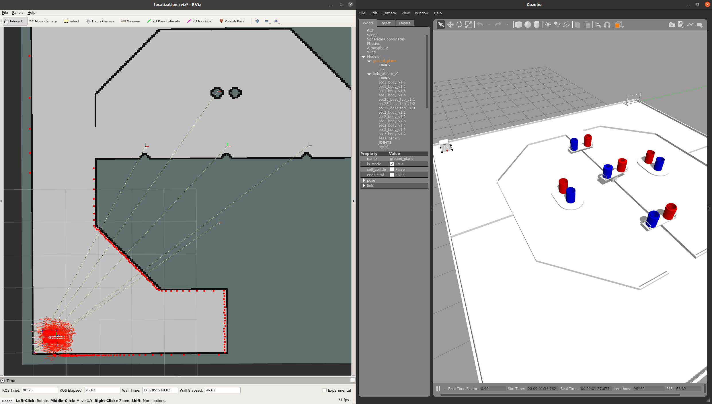

# nhk2021_ilias_docker
Docker environment for [nhk2021 ilias](https://github.com/KeioRoboticsAssociation/nhk2021_ilias) project



## Install

```shell
git clone --init --recursive https://github.com/Decwest/nhk2021_ilias_docker.git
cd nhk2021_ilias_docker
./build.sh
```

## Launch docker container
```shell
./run.sh
NHK2021_ILIAS root:~/catkin_ws$ catkin_make
```

## RUN 
See [nhk2021_ilias](https://github.com/KeioRoboticsAssociation/nhk2021_ilias) README

Ex)
```shell
roslaunch nhk2021_simulator swerve_simulation_TR.launch
roslaunch nhk2021_launcher control_TR.launch
```
